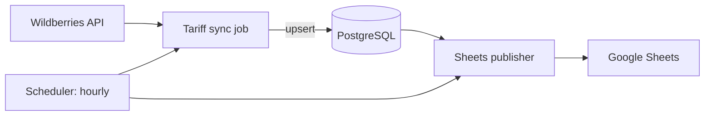

# wildberries-tariff-sync

[](https://github.com/Husqvarnalox/wildberries-tariff-sync/actions/workflows/ci.yml)
[](LICENSE)

A TypeScript service that periodically pulls Wildberries warehouse box tariffs, stores them idempotently in PostgreSQL, and publishes the normalized dataset to one or more Google Sheets.

## Overview

The service runs two hourly jobs in a single Node.js process:

1. **Tariff sync** – fetches the box tariff list from the Wildberries API, normalizes it, and upserts it into PostgreSQL.
2. **Sheets publish** – reads the stored tariffs and rewrites the `stocks_coefs` sheet in every configured spreadsheet.

Re-running a sync on the same day updates existing rows instead of duplicating them.

## Architecture



| Component | Source | Notes |
| --- | --- | --- |
| Scheduler | `src/services/scheduler.service.ts` | Hourly `setInterval`; per-task circuit breaker opens after 5 consecutive failures and resets after 1 hour |
| WB client | `src/services/wb-api.service.ts` | `fetch` with 30 s timeout, 3 attempts with linear backoff, response shape validation |
| Normalization | `src/services/tariff-parsing.ts`, `tariffs-sync.service.ts` | Decimal-comma parsing, percent → multiplier, invalid warehouses skipped and logged |
| Persistence | `src/services/tariffs-db.service.ts` | Batched transactional upsert on `(date, warehouse_name, box_delivery_and_storage_expr)` |
| Sheets publisher | `src/services/google-sheets.service.ts` | Service-account auth, creates the sheet if missing, clears and rewrites values; spreadsheets updated independently (`Promise.allSettled`) |
| Migrations | `src/postgres/migrations` | Knex; run automatically on startup |

## Quick start

Prerequisites: Docker with Compose, a Wildberries API token, and a Google service account with access to the target spreadsheets (share each sheet with the service account's email).

```bash
cp example.env .env                      # then fill in WBTOKEN and SPREADSHEET_IDS
cp /path/to/service-account.json ./google-credentials.json
docker compose up --build
```

Stop with `docker compose down` (add `--volumes` to drop the database).

Verify:

```bash
docker compose logs -f app
docker exec -it postgres psql -U postgres -d postgres -c "SELECT date, count(*) FROM wb_tariffs GROUP BY date ORDER BY date DESC;"
```

## Configuration

| Variable | Description |
| --- | --- |
| `POSTGRES_PORT`, `POSTGRES_DB`, `POSTGRES_USER`, `POSTGRES_PASSWORD` | PostgreSQL connection (`POSTGRES_HOST` is set by Compose) |
| `WBTOKEN` | Wildberries API token |
| `GOOGLE_CREDENTIALS_PATH` | Path to the service-account JSON inside the container |
| `SPREADSHEET_IDS` | Comma-separated spreadsheet IDs; IDs stored in the `spreadsheets` table are merged in |
| `APP_PORT` | Reserved; the service does not expose an HTTP interface |

## Local development

Requires Node.js 20+ and a reachable PostgreSQL instance configured through `.env`.

```bash
npm ci
npm run dev          # tsx + nodemon
npm run typecheck
npm test
npm run build && npm start
```

## Testing

`npm test` runs unit tests (Node's built-in runner via `tsx`) for tariff parsing and coefficient normalization. The WB client, database layer and Sheets publisher are not covered by automated tests, and CI does not call external APIs.

## Limitations

- Fixed hourly schedule; not configurable.
- Single-process scheduler: running several replicas would publish redundantly (the upsert keeps the data consistent, though).
- The Sheets publisher rewrites the whole `stocks_coefs` sheet on every run.
- Failed jobs are retried only on the next tick (WB requests additionally retry up to 3 times in-run).
- Logging is plain `console` output; sheet headers are in Russian.
- The seed inserts a placeholder row (`example_spreadsheet_id`) into `spreadsheets`, which is ignored at publish time.

## License

Apache-2.0 – see [LICENSE](LICENSE).
