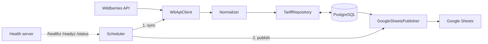

# wildberries-tariff-sync

[](https://github.com/Husqvarnalox/wildberries-tariff-sync/actions/workflows/ci.yml)
[](https://github.com/Husqvarnalox/wildberries-tariff-sync/actions/workflows/release.yml)
[](https://github.com/Husqvarnalox/wildberries-tariff-sync/pkgs/container/wildberries-tariff-sync)
[](LICENSE)
[](.nvmrc)

A TypeScript service that pulls Wildberries box tariffs on a schedule, keeps a dated history in PostgreSQL, and publishes the current dataset to Google Sheets.

## Why

Wildberries warehouse tariffs change daily and the API exposes only the current state. Teams that plan logistics need the history to analyze trends and a live sheet that non-engineers can filter and share. This service automates both: an idempotent store of every day's tariffs and an always-fresh spreadsheet, with failures isolated so that one broken dependency does not stop the rest.

## Features

- Idempotent upserts keyed by `(date, warehouse_name, box_delivery_and_storage_expr)`; safe to re-run.
- Zod-validated Wildberries responses; invalid warehouses are skipped and logged, not fatal.
- Retries with exponential backoff and jitter on network errors, 5xx and 429; no retries on other 4xx.
- Timestamp-based circuit breaker per pipeline step.
- Publishing to multiple spreadsheets with per-spreadsheet failure isolation.
- Configurable publish scope: latest date or full history.
- Health, readiness and status HTTP endpoints; structured JSON logs.
- Multi-stage Docker image running as a non-root user; multi-arch images on GHCR.

## Architecture



### Pipeline cycle

1. The scheduler starts a cycle (at boot if `RUN_ON_START=true`, then every `SYNC_INTERVAL_MS`).
2. **Sync step**: fetch box tariffs, validate and normalize them, upsert into PostgreSQL. Fails if no valid rows remain.
3. **Publish step**: read rows from PostgreSQL (per `SHEETS_PUBLISH_SCOPE`), rewrite the sheet in every configured spreadsheet.
4. Each step has its own circuit breaker. The next cycle is scheduled only after the current one finishes, so cycles never overlap.

### Components

| Component | File | Responsibility |
| --- | --- | --- |
| Composition root | `src/app.ts` | Wiring, migrations, graceful shutdown |
| Config | `src/config/env.ts` | Zod-validated `loadConfig(process.env)` |
| WB client | `src/wb/wb-api.client.ts` | HTTP, retry, response validation |
| WB schema | `src/wb/wb-tariffs.schema.ts` | Zod schema of the tariffs response |
| Normalizer | `src/tariffs/tariff.normalizer.ts` | Wildberries rows to `TariffRow`, skip invalid |
| Parsing | `src/tariffs/tariff-parsing.ts` | Decimal-comma parsing, coefficient calculation |
| Repository | `src/tariffs/tariff.repository.ts` | Batched upserts and queries via Knex |
| Sync service | `src/tariffs/tariffs-sync.service.ts` | One sync run: fetch, normalize, save |
| Publisher | `src/sheets/google-sheets.publisher.ts` | Rewrite sheets, per-spreadsheet isolation |
| Registry | `src/sheets/spreadsheet.registry.ts` | Merge spreadsheet IDs from DB and config |
| Scheduler | `src/scheduler/scheduler.ts` | Sequential cycle, breakers, status |
| Circuit breaker | `src/lib/circuit-breaker.ts` | Closed, open, half-open by timestamp |
| Retry | `src/lib/retry.ts` | Exponential backoff with full jitter |
| Health server | `src/http/health.server.ts` | `/healthz`, `/readyz`, `/status` |

## Project layout

```text
src/
  app.ts
  cli/knex.ts
  config/{env.ts, knex/}
  http/health.server.ts
  lib/{logger,clock,retry,circuit-breaker}.ts
  postgres/{knex.ts, migrations/, seeds/}
  scheduler/scheduler.ts
  sheets/{google-auth,google-sheets.publisher,spreadsheet.registry}.ts
  tariffs/{tariff.model,tariff-parsing,tariff.normalizer,tariff.repository,tariffs-sync.service}.ts
  wb/{wb-api.client,wb-tariffs.schema}.ts
docs/{operations.md, adr/}
```

Tests sit next to the code: `*.test.ts` (unit) and `*.integration.test.ts`.

## Quick start

Prerequisites: Docker with Compose, a Wildberries API token, and a Google service account. Share each target spreadsheet with the service account's email.

```bash
cp .env.example .env                       # set WBTOKEN, POSTGRES_PASSWORD, SPREADSHEET_IDS
cp /path/to/service-account.json ./google-credentials.json
docker compose up --build
```

Verify:

```bash
curl localhost:5000/status
docker compose exec postgres psql -U postgres -d postgres \
  -c "SELECT date, count(*) FROM wb_tariffs GROUP BY date ORDER BY date DESC;"
```

Stop with `docker compose down` (add `--volumes` to drop the database).

## Configuration

Variables are read from the environment (`.env` is loaded by `src/app.ts`). See `.env.example`.

| Variable | Default | Description |
| --- | --- | --- |
| `POSTGRES_HOST` | `localhost` | Compose sets `postgres` |
| `POSTGRES_PORT` | `5432` | |
| `POSTGRES_DB` | `postgres` | |
| `POSTGRES_USER` | `postgres` | |
| `POSTGRES_PASSWORD` | required | |
| `WBTOKEN` | required | Wildberries API token |
| `WB_API_BASE_URL` | `https://common-api.wildberries.ru` | Override for tests or mocks |
| `WB_REQUEST_TIMEOUT_MS` | `30000` | Per-request timeout |
| `WB_RETRY_ATTEMPTS` | `3` | Attempts per request |
| `GOOGLE_CREDENTIALS_PATH` | required | Service-account JSON path |
| `SPREADSHEET_IDS` | empty | Comma-separated; merged with the `spreadsheets` table |
| `SHEETS_SHEET_NAME` | `stocks_coefs` | Target sheet name |
| `SHEETS_PUBLISH_SCOPE` | `latest` | `latest` or `all` (full history) |
| `SYNC_INTERVAL_MS` | `3600000` | Pipeline cadence |
| `RUN_ON_START` | `true` | Run a cycle at boot |
| `CIRCUIT_BREAKER_THRESHOLD` | `5` | Consecutive failures to open |
| `CIRCUIT_BREAKER_RESET_MS` | `3600000` | Time before a half-open attempt |
| `APP_PORT` | `5000` | Health and status HTTP port |
| `LOG_LEVEL` | `info` | pino level |
| `NODE_ENV` | `development` | `development`, `production` or `test` |
| `TEST_DATABASE_URL` | unset | Integration tests only |

## Local development

```bash
nvm use
npm ci
cp .env.example .env                 # POSTGRES_HOST=localhost
docker compose up -d postgres
npm run dev
```

| Script | Purpose |
| --- | --- |
| `dev` | Run with watch mode and pretty logs |
| `build` | Compile to `dist/` |
| `start` | Run the compiled app |
| `typecheck` | TypeScript check |
| `lint` | ESLint |
| `format` | Prettier write (`format:check` verifies) |
| `test` | Unit tests |
| `test:integration` | Integration tests (needs `TEST_DATABASE_URL`) |
| `check` | Typecheck, lint, format check, unit tests |
| `knex` | Migration CLI on the compiled build (`knex:dev` uses `tsx`) |

## Testing strategy

- **Unit tests** cover pure modules (parsing, normalizer, retry, circuit breaker, config) and orchestration with fakes for `fetch`, the Sheets client, the clock and timers.
- **Integration tests** exercise the repository against a real PostgreSQL and run only when `TEST_DATABASE_URL` is set.
- CI never calls the live Wildberries or Google APIs.

## Observability

Logs are structured pino JSON with a `module` field. Set the verbosity with `LOG_LEVEL`. `npm run dev` pretty-prints them.

| Endpoint | Description |
| --- | --- |
| `GET /healthz` | Liveness, `200 {"status":"ok"}` |
| `GET /readyz` | `200` if PostgreSQL answers `select 1`, otherwise `503` |
| `GET /status` | Scheduler state per step |

Example `/status`:

```json
{
  "running": true,
  "cycleInFlight": false,
  "intervalMs": 3600000,
  "nextRunAt": "2026-10-10T09:00:00.000Z",
  "steps": {
    "tariffs_sync": {
      "lastRunAt": "2026-10-10T08:00:00.000Z",
      "lastSuccessAt": "2026-10-10T08:00:00.000Z",
      "lastError": null,
      "consecutiveFailures": 0,
      "breakerState": "closed"
    },
    "sheets_publish": {
      "lastRunAt": "2026-10-10T08:00:02.000Z",
      "lastSuccessAt": null,
      "lastError": "All 1 spreadsheet update(s) failed: 1abc...: The caller does not have permission",
      "consecutiveFailures": 1,
      "breakerState": "closed"
    }
  }
}
```

## Operations

The full runbook is in [docs/operations.md](docs/operations.md).

- **Circuit breaker**: after `CIRCUIT_BREAKER_THRESHOLD` consecutive failures a step is skipped until `CIRCUIT_BREAKER_RESET_MS` has passed, then retried in half-open state. Inspect `lastError` in `/status`.
- **Migrations** run on startup. Manually: `npm run knex -- migrate latest|rollback|list`.
- **Force a cycle**: restart the service with `RUN_ON_START=true`.
- **Rotate credentials**: update `WBTOKEN` or replace the credentials file, then restart.

## Design decisions

- [ADR 0001: Single-process scheduler](docs/adr/0001-single-process-scheduler.md)
- [ADR 0002: Idempotent upsert key](docs/adr/0002-idempotent-upsert-key.md)
- [ADR 0003: Circuit breaker per step](docs/adr/0003-circuit-breaker-per-step.md)
- [ADR 0004: Sheets publish scope](docs/adr/0004-sheets-publish-scope.md)

## Limitations and roadmap

Limitations:

- Single replica only; there is no leader election.
- The Sheets publisher rewrites the whole sheet on every run.
- Dates are UTC.
- Sheet headers are in Russian.
- The seed inserts a placeholder `example_spreadsheet_id` row, which is ignored at publish time.

Roadmap: Prometheus metrics, cron-expression scheduling, leader lock via PostgreSQL advisory lock.

## Contributing, security, license

See [CONTRIBUTING.md](CONTRIBUTING.md), [SECURITY.md](SECURITY.md) and [CHANGELOG.md](CHANGELOG.md). Licensed under Apache-2.0, see [LICENSE](LICENSE).
